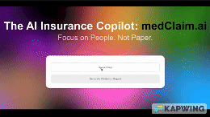

## Inspiration
The inspiration behind MedClaim AI stems from the growing need for efficiency and transparency in the medical insurance industry. With the increasing complexity of insurance claims and the rising instances of fraud, we recognized the potential of Generative AI to revolutionize the way claims are processed. By leveraging advanced AI technologies, we aim to create a system that not only speeds up the claims process but also ensures accuracy and fairness for all stakeholders involved.

## What it does
MedClaim AI is a Generative AI-powered system designed to streamline and secure the medical insurance claims process. It classifies and validates documents such as insurance policies, claims, and doctor's notes. The system cross-checks claims against policies and medical guidelines to ensure compliance and detects potential fraud through anomaly detection. Finally, it generates a concise summary report that includes validated claims, fraud risk assessments, and actionable insights, enabling quick and informed decision-making.

## How we built it
We built MedClaim AI using a combination of Natural Language Processing (NLP) techniques and Generative AI models. The system architecture consists of three main layers:

Input Layer: Allows users to upload insurance policies, claims, and doctor's notes.

Document Classification: Uses Finetuned Google DocumentAI Classifier to categorize uploaded documents.

Validation Engine: Cross-references claims with policies and medical guidelines using RAG on a Cohere LLM.

Fraud Detection: Analyzes patterns and anomalies using cosine similarity between the policy document and the submitted insurance claims.

Output Layer: Generates a comprehensive summary report using Cohere with validated claims, fraud risk assessments, and actionable insights.

## Challenges we ran into
One of the most significant challenges we faced was the lack of publicly available insurance claims datasets. Due to the sensitive nature of medical insurance data, finding real-world datasets to train and fine-tune our models proved to be a major hurdle. To overcome this, we had to manually curate a dataset by gathering sample claims from publicly available sources. Furthermore we had to ensure the accuracy of document classification and validation, especially given the variability in document formats and terminologies. Additionally, training the fraud detection models to accurately identify anomalies without generating false positives was a significant hurdle. Integrating all these components into a seamless, user-friendly system also required extensive testing and iteration.

## Accomplishments that we're proud of
We are proud to have developed a system that significantly reduces the time and cost associated with medical insurance claims processing. Our solution has demonstrated the potential to cut processing time to a few minutes and reduce fraud-related losses. Additionally, we have created a tool that not only benefits insurance companies but also enhances the experience for healthcare providers and policyholders.

## What we learned
Throughout the development of MedClaim AI, we gained valuable insights into the complexities of the medical insurance industry and the potential of AI to address these challenges. We learned the importance of robust data preprocessing and the need for continuous model training to adapt to new fraud patterns. Collaboration and iterative testing were key to refining our system and ensuring its reliability.

## What's next for MedClaim AI
Looking ahead, we plan to expand the capabilities of MedClaim AI by incorporating more advanced machine learning models and expanding its database to include a wider range of medical guidelines and policies. We also aim to enhance the user interface to make the system more accessible to non-technical users. Additionally, we will explore partnerships with insurance companies and healthcare providers to implement MedClaim AI on a larger scale, further driving efficiency and transparency in the industry.
